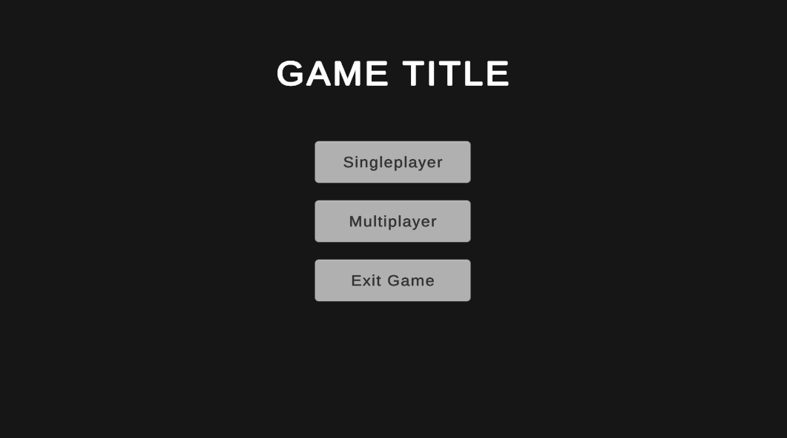
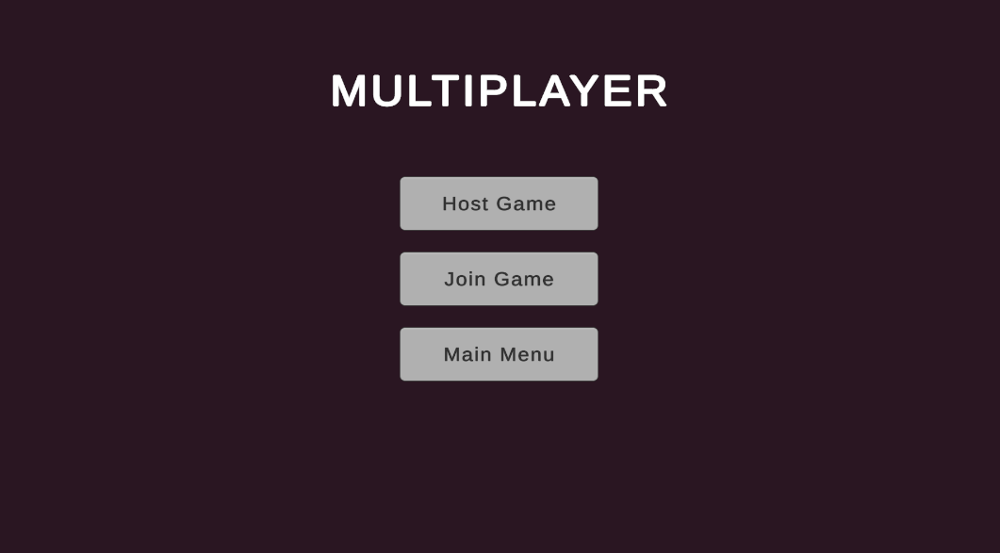
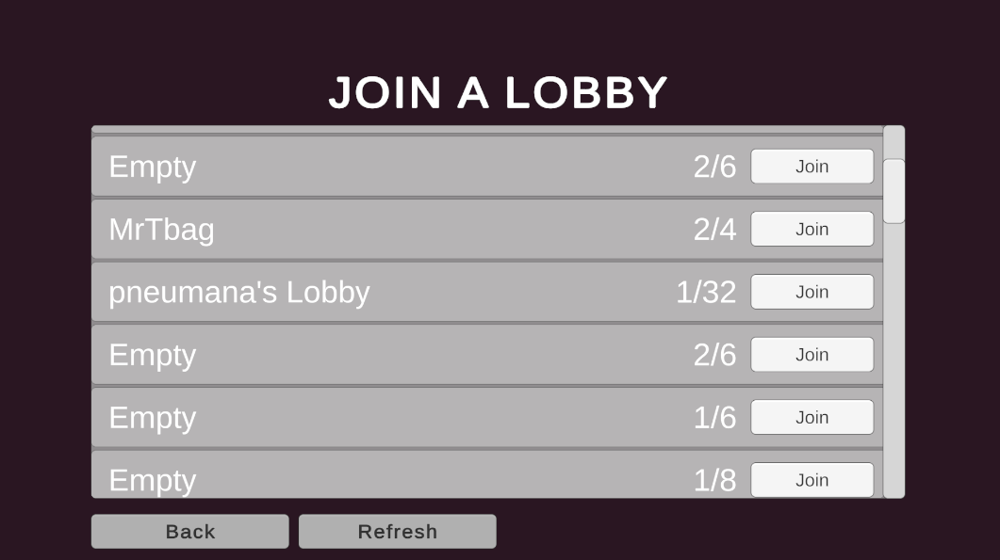
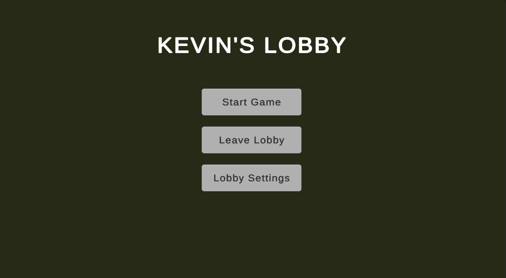
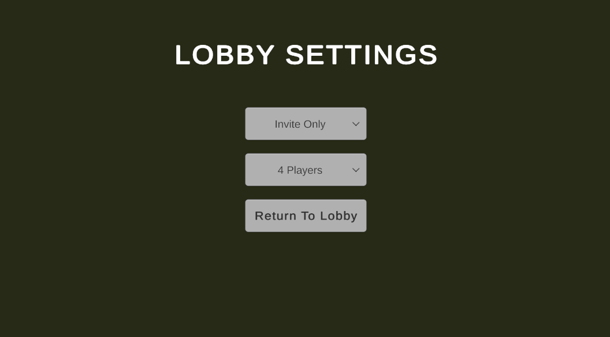

# UnitySteamMultiplayerBoilerplate

UnitySteamMultiplayerBoilerplate is an example project that demonstrates how to set up a multiplayer and singleplayer game using Heathen Steamworks and Fish-Networking. The boilerplate comes with essential scenes and scripts to help you get started quickly.

## Table of Contents
- [Overview](#overview)
- [Screenshots](#screenshots)
- [Scenes](#scenes)
    - [Startup Scene](#startup-scene)
    - [Bootstrap Scene](#bootstrap-scene)
    - [Main Menu Scene](#main-menu-scene)
    - [Game Scene](#game-scene)
- [Scripts](#scripts)
    - [StartupManager](#startupmanager)
    - [BootstrapManager](#bootstrapmanager)
    - [MainMenuManager](#mainmenumanager)
    - [LobbyItem](#lobbyitem)
    - [SteamManager](#steammanager)
    - [SceneLoader](#sceneloader)
    - [NetworkSceneLoader](#networksceneloader)
- [Getting Started](#getting-started)
    - [Requirements](#requirements)
    - [Installation](#installation)
    - [Usage](#usage)
- [Contributing](#contributing)
- [License](#license)

## Overview

This project is designed as an example to help you understand how to integrate Heathen Steamworks and Fish-Networking into your Unity project for both singleplayer and multiplayer functionality. It provides a foundation that you can build upon or use as a reference for your own game development.

All managers in this project use the Singleton pattern to ensure there is only one instance of each manager throughout the game.

The code is well-documented, providing detailed information about the functionality and usage of each script. You can refer to the code for further insights and explanations.

## Screenshots

### Main Menu

### Multiplayer Menu

### Join A Lobby Menu

### Lobby Menu

### Lobby Settings Menu

## Scenes

### Startup Scene
The entry point of the game. This scene is intended for displaying boot menus or sponsor screens. It uses the `StartupManager` script to load the Bootstrap scene.

### Bootstrap Scene
Handles the initialization of all game managers. This scene uses additive scene loading to remain in the background throughout the game, ensuring that the managers persist across scene changes. It uses the `BootstrapManager` script to validate the initialization of necessary managers and load the Main Menu scene.

### Main Menu Scene
Manages the main menu interface, multiplayer lobbies, and transitions to the game scene. It provides options for creating or joining lobbies and starting the game. The `MainMenuManager` script handles these functionalities.

### Game Scene
An empty scene that is loaded when starting a singleplayer or multiplayer game. The `SceneLoader` script is used for singleplayer transitions, while the `NetworkSceneLoader` script handles multiplayer transitions.

## Scripts

### StartupManager
Handles the startup sequence and transitions to the Bootstrap scene. Extend this script to add any boot menus or sponsor screens.

### BootstrapManager
Ensures all systems and managers are loaded before transitioning to the Main Menu scene. This script makes sure that essential components like `NetworkManager`, `SteamManager`, `SceneLoader`, and `NetworkSceneLoader` are initialized.

### MainMenuManager
Manages the main menu interface, multiplayer lobbies, and transitions to the game scene. This script handles lobby creation, joining, leaving, and starting both singleplayer and multiplayer games.

### LobbyItem
Represents each lobby object in the Main Menu's lobby viewer. This script manages the display and interaction with lobby data.

### SteamManager
Handles all Steam-related callbacks and functions. This script manages lobby creation, joining, leaving, and updating lobby metadata. It ensures integration with Steamworks is seamless.

### SceneLoader
Handles any singleplayer scene changes. Use this script to load and close scenes in a singleplayer context.

### NetworkSceneLoader
Handles any multiplayer scene changes. This script ensures that scenes are loaded and synchronized across all players in a networked game.

## Getting Started

### Requirements
- Unity 6 Preview (should also work with versions 2021.1 or later)

### Installation
1. Clone this repository to your local machine.
2. Open the project in Unity. Heathen Steamworks (Foundation) and Fish-Networking will be automatically installed as they are included in the `manifest.json` file.

### Usage
1. Start with the Startup scene and follow the flow to Bootstrap, Main Menu, and then Game scene.
2. Modify the scripts and scenes as needed for your game.
3. Use the provided managers and loaders for handling scenes and multiplayer functionality.

## Contributing

Contributions are welcome! Feel free to submit pull requests or report issues to improve this project.

## License

This project is licensed under the MIT License. See the LICENSE file for details.

---
